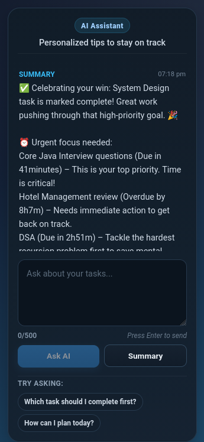

# Task Tracker Frontend

### AI-Powered Task Management Platform built with React and Vite

Task Tracker Frontend is a modern and responsive task management application that helps users organize work, track deadlines, monitor progress, and receive AI-powered productivity insights.

The application provides secure authentication, personalized task management, overdue task detection, intelligent task prioritization, and an integrated AI assistant that helps users stay focused and productive.

> This repository contains the **frontend application**. The backend API is maintained in a separate repository and deployed independently.

---

## Live Application

**Frontend Application**

https://tasktracker.app.devendra.indevs.in

---

## Features

### Authentication

- User Registration
- User Login
- JWT-Based Authentication
- Protected Routes
- Secure Session Handling

### Task Management

- Create Tasks
- View Tasks
- Update Tasks
- Delete Tasks
- Task Status Management
- Priority Management
- Due Date Tracking

### Dashboard Experience

- Real-Time Task Overview
- Total, Todo, In Progress, and Done Statistics
- Search Tasks by Keyword
- Filter by Status
- Filter by Priority
- Due Date Sorting
- Default Latest-First Task Ordering
- Responsive Dashboard Layout

### Productivity Features

- Overdue Task Detection
- Overdue Task Highlighting
- Intelligent Task Prioritization
- Deadline Awareness
- Progress Visibility

### AI Assistant

The dashboard includes an AI-powered productivity assistant that analyzes task data and provides:

- Personalized Task Summaries
- Overdue Task Analysis
- Priority Recommendations
- Productivity Suggestions
- Deadline-Aware Planning Guidance
- Natural Language Task Assistance

AI responses are generated using the authenticated user's task data to provide personalized recommendations.
Recommendations dynamically change based on task status, priority, due dates, and overdue conditions.
---

## Screenshots

### Dashboard


### AI Assistant



### Authentication


---

## Tech Stack

### Frontend

- React
- Vite
- JavaScript (ES6+)
- CSS

### Authentication

- JWT Authentication
- Protected Client Routes

### API Integration

- Fetch API
- REST API Communication

### Deployment

- Vercel
- Custom Domain
- HTTPS

---

## Architecture

```text
React Frontend
        │
        ▼
JWT Authentication
        │
        ▼
Spring Boot REST API
        │
        ▼
Spring AI Services
        │
        ▼
PostgreSQL Database
```

The frontend communicates with a secure Spring Boot backend through authenticated REST API requests.

---

## Authentication Flow

1. User signs up or logs in
2. Backend validates credentials
3. JWT token is returned to the frontend
4. Token is stored on the client side
5. Protected API requests include the Bearer token
6. Users can access only their own task data

---

## Backend Integration

This frontend integrates with a backend API built using:

- Spring Boot
- Spring Security
- JWT Authentication
- PostgreSQL
- Spring AI
- AWS EC2
- Amazon RDS PostgreSQL

Backend Repository:

https://github.com/devendra1176/task-tracker-api

---

## Responsive Design

The application is designed to work across:

- Desktop Devices
- Tablets
- Mobile Devices

Responsive layouts ensure a consistent user experience across different screen sizes.

---

## Run Locally

### Requirements

- Node.js
- npm

### Clone Repository

```bash
git clone https://github.com/devendra1176/task-tracker-frontend.git
cd task-tracker-frontend
```

### Install Dependencies

```bash
npm install
```

### Start Development Server

```bash
npm run dev
```

### Application URL

```text
http://localhost:5173
```

---

## Deployment

### Frontend

- Hosted on Vercel
- Custom Domain Enabled
- HTTPS Secured

### Backend

- Hosted Separately
- AWS EC2 Deployment
- Amazon RDS PostgreSQL
- GitHub Actions CI/CD Pipeline

---

## Future Improvements

- Inline Task Editing
- Advanced Dashboard Analytics
- Enhanced Mobile Experience
- Additional AI Productivity Workflows
- Calendar View
- Notifications and Reminders
- Improved Accessibility

---

## Author

**Devendra Sahu**

Java Backend Developer | Spring Boot | AWS | PostgreSQL | AI Integration | REST APIs

---

## 🎯 Project Goal

This frontend was built to transform a secure backend system into a complete user experience by combining authentication, task management, productivity tracking, and AI-powered assistance within a modern and responsive dashboard.

The project demonstrates frontend engineering concepts including:

- Component-Based UI Development
- API Integration
- JWT Authentication Flow
- State Management
- Responsive Design
- User Experience Design
- AI Feature Integration

---